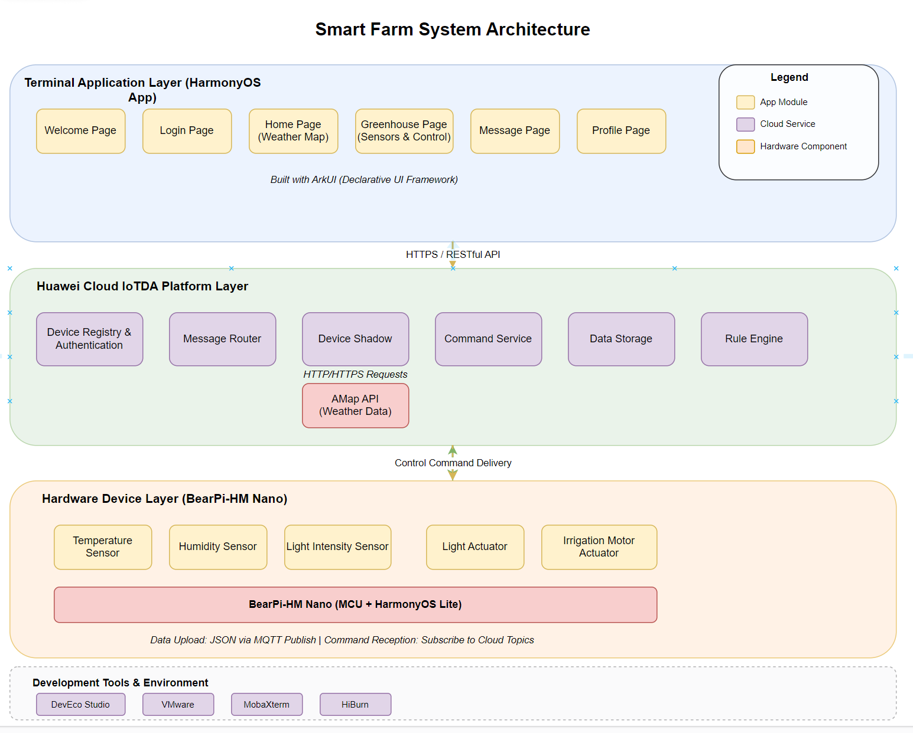
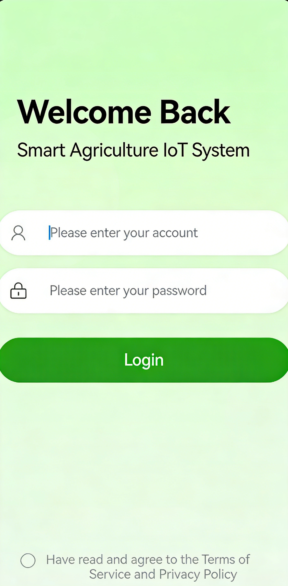
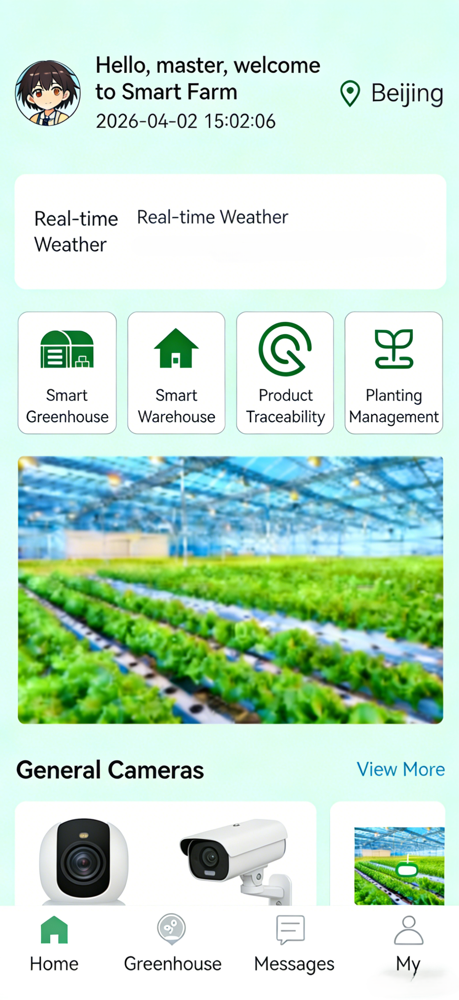
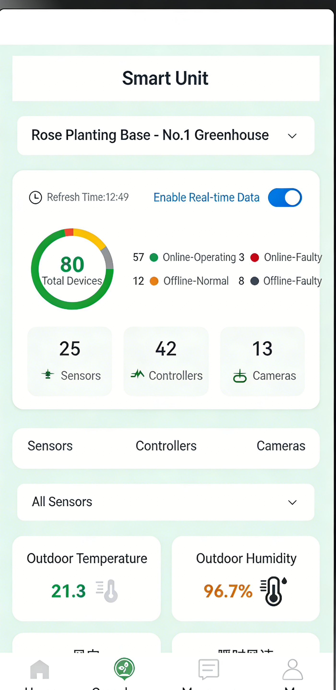
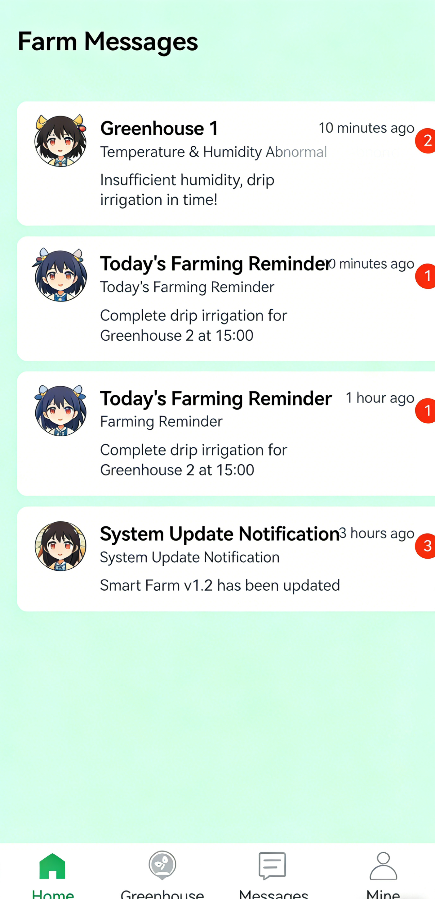
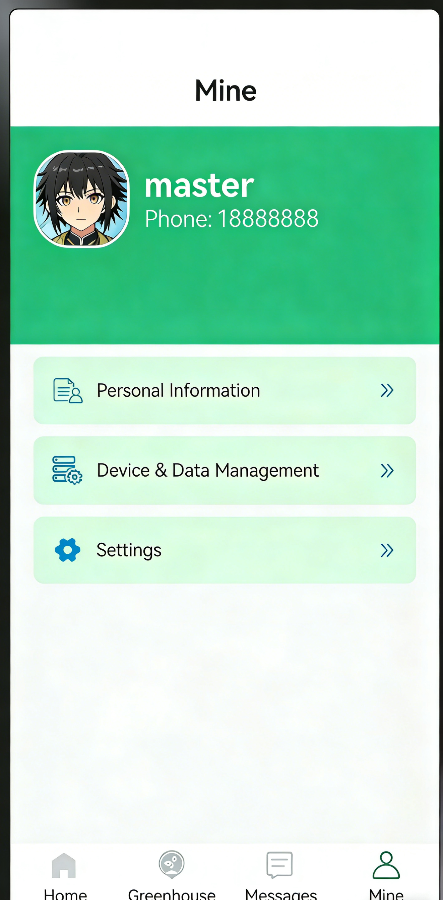

# HarmonyOS Smart Farm IoT System

An end-to-end cloud-integrated smart agriculture solution based on HarmonyOS + Huawei Cloud IoT + embedded hardware

---

## 📍 Project Overview(Results are in the media folder)

This project relies on the distributed capabilities of **HarmonyOS** and Huawei Cloud **IoTDA** IoT platform, combined with the BearPi-HM Nano development board, to realize an integrated smart farm system including **environmental monitoring, remote control, data visualization, and weather services**. It solves core problems of traditional agriculture such as high labor dependence, delayed regulation, and extensive management, and completes the full link from hardware → cloud → application.

---

## 🧱 Core Technology Architecture



> Three-tier end-cloud collaborative architecture: **End Application Layer → Huawei Cloud IoTDA Platform Layer → Hardware Device Layer**

---

## 🚀 Core Tech Stack

| Category | Technology/Tool | Role |
|----------|-----------------|------|
| OS | HarmonyOS | Distributed soft bus, application and device foundation |
| IDE | DevEco Studio 6.0 | ArkUI development, compilation, debugging |
| Frontend Framework | ArkUI | Declarative UI, page interaction |
| Cloud Platform | Huawei Cloud IoT (IoTDA) | Device access, message routing, command delivery, data storage |
| Hardware | BearPi-HM Nano | Temperature/humidity/light collection, light/motor control |
| Communication | MQTT/HTTPS | Device connection to cloud, app calling cloud APIs |
| Third-party Service | Amap Weather API | Real-time meteorological data display |
| Compile/Burn | Ubuntu + HiBurn | Embedded firmware compilation and flashing |
| Remote Tool | MobaXterm | SSH connection, log debugging |

---

## 🔧 Core Functions

- ✅ Full HarmonyOS UI: Splash → Login → Home / Greenhouse / Message / Mine tab navigation
- ☁️ Huawei Cloud IoT unified access: device registration, model definition, property reporting, command delivery
- 🌡 Real-time sensor monitoring: cloud synchronization of temperature, humidity, light intensity
- 🎛 Remote device control: on/off control for fill light and irrigation motor
- 🌤 Amap weather integration: real-time weather display for Fuzhou
- 📊 Data visualization: device status statistics, sensor card display
- 🔐 IAM identity authentication: secure cloud API calls

---

## 📂 System Architecture

```
End Application Layer (HarmonyOS + ArkUI)
        ↓ HTTPS/API
Huawei Cloud IoTDA Platform (device management, message routing, data persistence)
        ↓ MQTT
Hardware Device Layer (BearPi-HM Nano + sensors/actuators)
```

---

## ⭐ Core Technology Implementation

### 1. Huawei Cloud IoT Device Model Definition
- Product: `Smart Agriculture Greenhouse Bearpi`
- Service: `Agriculture`
- Properties: Temperature, Humidity, Luminance, LightStatus, MotorStatus
- Commands: `Agriculture_Control_light` / `Agriculture_Control_Motor`

### 2. Bidirectional Communication: App ↔ Cloud ↔ Hardware
1. Device connects to Huawei Cloud via **MQTT** and reports sensor data periodically
2. HarmonyOS App obtains device shadow via IoTDA API over **HTTPS**
3. Control commands are sent via cloud API → forwarded by Huawei Cloud → executed by device
4. Device status reported → cloud synchronized → UI refreshed in real time

### 3. HarmonyOS ArkUI Architecture
- Linear layout + bottom tab navigation
- Home: weather cards, function entries
- Greenhouse: sensor data + controller + camera entrance
- Message: alarm/notification list
- Mine: user info and settings

### 4. Hardware Firmware Development & Burning
- Compile BearPi project in Ubuntu VM
- Flash `.bin` firmware with HiBurn
- Data collection → JSON packaging → MQTT reporting
- Command subscription → parsing → GPIO hardware control

---

## 🧪 Training & Implementation Process

1. Environment setup: DevEco Studio + VMware + MobaXterm
2. UI development: splash, login, main interface, tab modules
3. Huawei Cloud configuration: product model → register device → get keys/API
4. Device development: connect to IoT platform, data reporting, command handling
5. Application development: API encapsulation, weather integration, control logic
6. Integration test: data synchronization, command delivery, stability verification

---

## 📈 Practical Results

- Smooth page navigation and tab switching
- Sensor data updated in 3 seconds
- Fast remote control response and accurate status synchronization
- Normal Amap weather display, high device online rate and data consistency
- Complete **end-cloud-hardware** full-link demonstrable system

---

## 📁 Directory Structure

```
├── media/           # Image resources (including core architecture imagecore.png)
├── entry/           # Main module of HarmonyOS application
├── README.md        # Project documentation
└── doc/             # Training documents
```

---


## 🖼️ The demonstration results


<table>
  <tr>
    <td></td>
    <td></td>
    <td></td>
  </tr>
  <tr>
    <td></td>
    <td></td>
    <td></td>
  </tr>
</table>
## 📌 Summary

This project fully implements a **HarmonyOS + Huawei Cloud IoT + embedded hardware** smart farm system. It covers engineering capabilities including **UI development, cloud platform docking, device access, bidirectional communication, remote control, and data visualization**, providing a practical and deployable smart agriculture IoT solution for training and demonstration.
